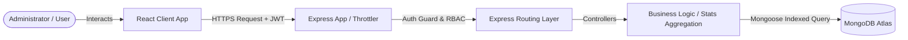

# 🚖 VehicleSphere - Full-Stack Vehicle Booking & Analytics Ecosystem

### A production-grade booking engine, analytics dashboard, and administrative console.

---

## 📖 Table of Contents
1. [Project Overview](#-project-overview)
2. [Ecosystem Architecture](#-ecosystem-architecture)
3. [Global Project Structure](#-global-project-structure)
4. [Quick Start & Setup Guide](#-quick-start--setup-guide)
5. [In-Depth Documentation links](#-in-depth-documentation-links)

---

## 🔍 Project Overview

**VehicleSphere** is an enterprise-scale full-stack application built to manage booking logistics, calculate complex statistics, and handle administrator workforce operations. It is composed of two primary components:

1. **[Backend API & Analytics Engine (Node/Express/MongoDB)](file:///d:/Vehicle_Bookings/backend/README.md)**: A secure RESTful API serving 18,289 indexed booking records with custom mongoose aggregation pipelines, advanced search, rate limiting, and JWT authentication.
2. **[Frontend Client Console (React/Vite/Tailwind/MUI)](file:///d:/Vehicle_Bookings/frontend/README.md)**: A modern, aesthetic analytics dashboard using Material UI and TailwindCSS v4/v3, Redux Toolkit state management, React Router v7, and custom path aliases.

---

## 🛠 Ecosystem Architecture



---

## 📂 Global Project Structure

```bash
Vehicle_Bookings/
├── README.md                 # Root combined project documentation
├── backend/                  # Node.js, Express, MongoDB server
│   ├── config/               # Database connection properties
│   ├── controllers/          # API business logic handlers
│   ├── data/                 # JSON booking dataset (18,289 entries)
│   ├── middlewares/          # JWT, Throttling, RBAC middlewares
│   ├── models/               # MongoDB models and schemas
│   ├── routes/               # API route maps
│   ├── README.md             # In-depth Backend documentation
│   └── ...
└── frontend/                 # React, Vite, Tailwind client
    ├── public/               # Static public images
    ├── src/                  # React components, stores, hooks
    │   ├── components/       # Shared UI components
    │   ├── features/         # Redux state slices
    │   ├── layouts/          # Main containers (Sidebar, Navbar)
    │   ├── pages/            # View pages and dashboards
    │   └── ...
    ├── README.md             # In-depth Frontend documentation
    └── ...
```

---

## ⚙ Quick Start & Setup Guide

Ensure you have **Node.js** and **MongoDB** running locally or a MongoDB Atlas URI ready.

### 1. Backend Server Setup
Navigate to the `backend/` directory, create a `.env` file, and boot the server:
```bash
cd backend
npm install
node seed.js  # Seeds the 18,289 bookings dataset
npm run dev
```
*The backend server will run on `http://localhost:5000`.*

### 2. Frontend Client Setup
In a new terminal, navigate to the `frontend/` directory, install packages, and boot the client:
```bash
cd frontend
npm install
npm run dev
```
*The client app will launch on `http://localhost:5173`.*

---

## 📡 In-Depth Documentation Links

For component-specific setup configurations, performance benchmarking, indexing strategies, routing configurations, and alias schemas, please refer to:

- 🚖 **[Backend Developer Guide](file:///d:/Vehicle_Bookings/backend/README.md)** — Core models, rate limiting, and endpoints reference.
- 🎨 **[Frontend Developer Guide](file:///d:/Vehicle_Bookings/frontend/README.md)** — Redux slices, MUI setup, Tailwind configurations, and aliases.
