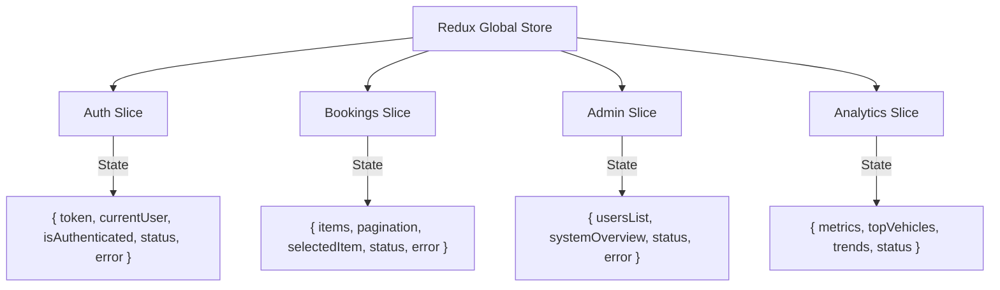

# 🚖 VehicleSphere - Backend API Mapping & Frontend Blueprint

This document serves as the **Single Source of Truth** for frontend developers building the VehicleSphere dashboard and client panel. It maps all available backend REST endpoints, payload schemas, query criteria, validation guidelines, Redux store mappings, and page flows.

---

## 🔐 1. Authentication & Session APIs

### Register New User
* **Endpoint**: `POST /api/v1/auth/register`
* **Purpose**: Create a new user account (defaults to `"user"` role).
* **Headers**: `Content-Type: application/json`
* **Request Body**:
  ```json
  {
    "name": "John Doe",
    "email": "john.doe@example.com",
    "password": "securepassword123"
  }
  ```
* **Validation Rules**:
  * `name`: String, required. Min length: 2 characters, Max length: 50 characters. Trims automatically.
  * `email`: String, required. Case-insensitive (normalized to lowercase). Must match RFC 5322 regex: `/^\w+([\.-]?\w+)*@\w+([\.-]?\w+)*(\.\w{2,3})+$/`.
  * `password`: String, required. Min length: 6 characters.
* **Success Response (201 Created)**:
  ```json
  {
    "success": true,
    "message": "User registered successfully"
  }
  ```
* **Error Responses**:
  * **400 Bad Request** (Missing/invalid fields or email already registered):
    ```json
    {
      "success": false,
      "message": "User already exists"
    }
    ```

---

### Login User
* **Endpoint**: `POST /api/v1/auth/login`
* **Purpose**: Authenticate credentials and retrieve a JWT access token.
* **Headers**: `Content-Type: application/json`
* **Request Body**:
  ```json
  {
    "email": "john.doe@example.com",
    "password": "securepassword123"
  }
  ```
* **Validation Rules**:
  * `email`: String, required.
  * `password`: String, required.
* **Success Response (200 OK)**:
  ```json
  {
    "success": true,
    "token": "eyJhbGciOiJIUzI1NiIsInR5cCI6IkpXVCJ9.eyJ1c2VySWQiOiI2NmU..."
  }
  ```
* **Error Responses**:
  * **401 Unauthorized** (Incorrect email or password):
    ```json
    {
      "success": false,
      "message": "Invalid email or password"
    }
    ```
  * **403 Forbidden** (Deactivated user account):
    ```json
    {
      "success": false,
      "message": "Your account is deactivated. Please contact administration"
    }
    ```

---

### Logout User
* **Endpoint**: `POST /api/v1/auth/logout`
* **Purpose**: Invalidate client token session.
* **Headers**: `Authorization: Bearer <JWT_TOKEN>`
* **Success Response (200 OK)**:
  ```json
  {
    "success": true,
    "message": "Logged out successfully"
  }
  ```

---

### Token Refresh
* **Endpoint**: `POST /api/v1/auth/refresh-token`
* **Purpose**: Exchange an expiring JWT token for a fresh access token.
* **Request Body**:
  ```json
  {
    "token": "eyJhbGciOiJIUzI1NiIsInR5cCI6IkpXVCJ9..."
  }
  ```
* **Success Response (200 OK)**:
  ```json
  {
    "success": true,
    "token": "eyJhbGciOiJIUzI1NiIsInR5cCI6IkpXVC..."
  }
  ```

---

## 👤 2. User Profile APIs

### Get Current User Profile
* **Endpoint**: `GET /api/v1/auth/me`
* **Purpose**: Fetch details of the currently authenticated user.
* **Headers**: `Authorization: Bearer <JWT_TOKEN>`
* **Success Response (200 OK)**:
  ```json
  {
    "success": true,
    "user": {
      "_id": "60d5ec9f1a29c122340f1a11",
      "name": "John Doe",
      "email": "john.doe@example.com",
      "role": "user",
      "isActive": true,
      "createdAt": "2026-06-05T12:00:00.000Z",
      "updatedAt": "2026-06-05T12:00:00.000Z"
    }
  }
  ```

---

### Update Profile
* **Endpoint**: `PUT /api/v1/profile` (Frontend Alias for user details update)
* **Purpose**: Allows current user to update their editable fields.
* **Headers**: `Authorization: Bearer <JWT_TOKEN>`
* **Request Body**:
  ```json
  {
    "name": "Johnathan Doe",
    "email": "john.new@example.com"
  }
  ```
* **Editable Fields**: `name`, `email`
* **Validation Rules**:
  * Matches user schema limits (name 2-50 chars, valid email syntax).
* **Success Response (200 OK)**:
  ```json
  {
    "success": true,
    "message": "Profile updated successfully",
    "data": {
      "_id": "60d5ec9f1a29c122340f1a11",
      "name": "Johnathan Doe",
      "email": "john.new@example.com",
      "role": "user",
      "isActive": true
    }
  }
  ```

---

## 👥 3. Administrative Users CRUD APIs

*Note: All endpoints under this group require admin credentials (`role: "admin"`).*

### Get All Users
* **Endpoint**: `GET /api/v1/admin/users`
* **Headers**: `Authorization: Bearer <JWT_TOKEN>` (Admin Only)
* **Success Response (200 OK)**:
  ```json
  {
    "success": true,
    "count": 2,
    "data": [
      {
        "_id": "60d5ec9f1a29c122340f1a11",
        "name": "John Doe",
        "email": "john.doe@example.com",
        "role": "user",
        "isActive": true,
        "createdAt": "2026-06-05T12:00:00.000Z"
      },
      {
        "_id": "60d5eca01a29c122340f1a12",
        "name": "Jane Admin",
        "email": "jane.admin@example.com",
        "role": "admin",
        "isActive": true,
        "createdAt": "2026-06-05T12:05:00.000Z"
      }
    ]
  }
  ```

---

### Get User By ID
* **Endpoint**: `GET /api/v1/admin/users/:id`
* **Headers**: `Authorization: Bearer <JWT_TOKEN>` (Admin Only)
* **Success Response (200 OK)**:
  ```json
  {
    "success": true,
    "data": {
      "_id": "60d5ec9f1a29c122340f1a11",
      "name": "John Doe",
      "email": "john.doe@example.com",
      "role": "user",
      "isActive": true,
      "createdAt": "2026-06-05T12:00:00.000Z"
    }
  }
  ```
* **Error Responses**:
  * **400 Bad Request**: Invalid MongoDB ObjectId path parameter format.
  * **404 Not Found**: User not found in database.

---

### Update User Role
* **Endpoint**: `PATCH /api/v1/admin/users/:id/role`
* **Headers**: `Authorization: Bearer <JWT_TOKEN>` (Admin Only)
* **Request Body**:
  ```json
  {
    "role": "admin"
  }
  ```
* **Validation Rules**:
  * `role`: String, required. Valid enums: `["user", "admin"]`.
* **Success Response (200 OK)**:
  ```json
  {
    "success": true,
    "message": "User role updated successfully",
    "data": {
      "_id": "60d5ec9f1a29c122340f1a11",
      "name": "John Doe",
      "email": "john.doe@example.com",
      "role": "admin",
      "isActive": true
    }
  }
  ```

---

### Disable/Enable User Status
* **Endpoint**: `PATCH /api/v1/admin/users/:id/status`
* **Headers**: `Authorization: Bearer <JWT_TOKEN>` (Admin Only)
* **Request Body**:
  ```json
  {
    "isActive": false
  }
  ```
* **Validation Rules**:
  * `isActive`: Boolean, required.
* **Success Response (200 OK)**:
  ```json
  {
    "success": true,
    "message": "User account disabled successfully",
    "data": {
      "_id": "60d5ec9f1a29c122340f1a11",
      "isActive": false
    }
  }
  ```

---

## 🚗 4. Bookings Management APIs

### Get All Bookings (Paginated & Filtered)
* **Endpoint**: `GET /api/v1/bookings`
* **Headers**: `Authorization: Bearer <JWT_TOKEN>`
* **Success Response (200 OK)**:
  ```json
  {
    "success": true,
    "pagination": {
      "total": 18289,
      "page": 1,
      "limit": 10,
      "pages": 1829
    },
    "data": [
      {
        "_id": "66e2c3b88c3a1b023e93a02a",
        "bookingId": "BK-2026-9817",
        "customerId": "CUST-8812",
        "customerName": "Robert Miller",
        "customerPhone": "+15550198",
        "vehicleType": "suv",
        "pickupLocation": "Times Square, NY",
        "dropLocation": "JFK Airport, NY",
        "distance": 15.4,
        "fare": 75.5,
        "bookingStatus": "completed",
        "paymentMethod": "card",
        "paymentStatus": "paid",
        "driverRating": 5,
        "customerRating": 4,
        "vTat": 8,
        "cTat": 11,
        "cancelledByCustomerReason": null,
        "cancelledByDriverReason": null,
        "isIncomplete": null,
        "incompleteReason": null,
        "bookingDate": "2026-06-05T10:15:00.000Z",
        "rideStartTime": "2026-06-05T10:23:00.000Z",
        "rideEndTime": "2026-06-05T11:04:00.000Z",
        "isDeleted": false,
        "createdAt": "2026-06-05T10:15:00.000Z"
      }
    ]
  }
  ```

---

### Get Booking By DB ID
* **Endpoint**: `GET /api/v1/bookings/:id`
* **Headers**: `Authorization: Bearer <JWT_TOKEN>`
* **Success Response (200 OK)**: Returns the single booking document under the `data` key.

---

### Create New Booking
* **Endpoint**: `POST /api/v1/bookings`
* **Headers**: `Authorization: Bearer <JWT_TOKEN>`, `Content-Type: application/json`
* **Request Body**:
  ```json
  {
    "bookingId": "BK-2026-9999",
    "customerId": "CUST-1111",
    "customerName": "Alice Smith",
    "customerPhone": "+15550100",
    "vehicleType": "sedan",
    "pickupLocation": "Grand Central, NY",
    "dropLocation": "Penn Station, NY",
    "distance": 2.1,
    "fare": 15.0,
    "bookingStatus": "pending",
    "bookingDate": "2026-06-05T15:00:00.000Z"
  }
  ```
* **Validation Rules**:
  * `vehicleType`: String, required.
  * `pickupLocation`: String, required.
  * `dropLocation`: String, required.
  * `distance`: Number, required. Min: 0.
  * `fare`: Number, required. Min: 0.
* **Success Response (201 Created)**:
  ```json
  {
    "success": true,
    "message": "Booking created successfully",
    "data": { ... }
  }
  ```

---

### Update Booking
* **Endpoint**: `PUT /api/v1/bookings/:id`
* **Headers**: `Authorization: Bearer <JWT_TOKEN>`
* **Request Body**: Provide full or partial booking fields object to override values.
* **Success Response (200 OK)**:
  ```json
  {
    "success": true,
    "message": "Booking updated successfully",
    "data": { ... }
  }
  ```

---

### Patch Booking Status
* **Endpoint**: `PATCH /api/v1/bookings/:id/status`
* **Headers**: `Authorization: Bearer <JWT_TOKEN>`
* **Request Body**:
  ```json
  {
    "bookingStatus": "completed"
  }
  ```
* **Success Response (200 OK)**: Status updated payload.

---

### Patch Booking Soft Delete
* **Endpoint**: `PATCH /api/v1/bookings/:id/soft-delete`
* **Headers**: `Authorization: Bearer <JWT_TOKEN>`
* **Purpose**: Marks `isDeleted: true` without removing the record from Mongo.
* **Success Response (200 OK)**:
  ```json
  {
    "success": true,
    "message": "Booking soft-deleted successfully"
  }
  ```

---

### Delete Booking Permanently
* **Endpoint**: `DELETE /api/v1/bookings/:id`
* **Headers**: `Authorization: Bearer <JWT_TOKEN>`
* **Success Response (200 OK)**:
  ```json
  {
    "success": true,
    "message": "Booking permanently deleted"
  }
  ```

---

## 🔍 5. Search & Telemetry Parameters

The backend supports global search, specific field lookups, and range query filters.

### Global Regex Search
* **Endpoint**: `GET /api/v1/search`
* **Query Parameter**: `keyword` (String, required)
* **Description**: Matches keyword across `bookingId`, `customerId`, `bookingStatus`, `vehicleType`, `pickupLocation`, `dropLocation`, `paymentMethod`, and cancellation/incomplete reasons. Returns up to 100 entries.
* **Example**: `/api/v1/search?keyword=Times`

---

### Field-Specific Search Endpoints
| HTTP Method | Route | Query Parameter | Target Search Area |
| :--- | :--- | :--- | :--- |
| **GET** | `/api/v1/search/bookings` | `bookingId` | Unique ID match |
| **GET** | `/api/v1/search/customers`| `customerId` | Customer reference code |
| **GET** | `/api/v1/search/payment` | `method` | Payment system string |
| **GET** | `/api/v1/search/vehicle` | `type` | Vehicle style class |
| **GET** | `/api/v1/search/location`| `pickup` OR `drop` | Locations keyword |
| **GET** | `/api/v1/search/cancel-reason`| `reason` | Cancellations text |
| **GET** | `/api/v1/search/incomplete`| `reason` | Incomplete status reason |
| **GET** | `/api/v1/search/rating` | `driver` OR `customer` | Exact numeric rating |

---

## 📄 6. Pagination & Query Modifiers

### Booking Query List Modifiers
When invoking `GET /api/v1/bookings`, append the following modifiers to slice, filter, or order outcomes:

#### Pagination parameters:
* `page`: Numeric index (Defaults to `1`).
* `limit`: Page count size (Defaults to `10`).

#### Core query filter mappings:
* `status`: Filters by `bookingStatus` (e.g. `completed`, `cancelled`, `pending`).
* `vehicle`: Filters by `vehicleType` (e.g. `suv`, `sedan`, `hatchback`, `prime`).
* `payment`: Filters by `paymentMethod` (e.g. `cash`, `card`, `upi`).
* `pickup`: Regex matches `pickupLocation`.
* `drop`: Regex matches `dropLocation`.
* `customer`: Matches exact `customerId`.
* `date`: Matches exact day `bookingDate` (filters range `00:00:00.000` to `23:59:59.999`).

#### Range Filters:
* `minFare` & `maxFare`: Filter by fare boundaries (e.g., `?minFare=50&maxFare=150`).
* `minDistance` & `maxDistance`: Filter by distance parameters.
* `minRating` & `maxRating`: Filter by ratings.

#### Sorting Parameters:
* `sort`: Ascending key (prefix with `-` for descending). Mapped keys are:
  * `Booking_Value` -> Mapped to `fare`
  * `Ride_Distance` -> Mapped to `distance`
  * `Driver_Ratings` -> Mapped to `driverRating`
  * `Customer_Rating` -> Mapped to `customerRating`
  * `Date` -> Mapped to `bookingDate`
  * `Vehicle_Type` -> Mapped to `vehicleType`
  * `Payment_Method` -> Mapped to `paymentMethod`
  * `Pickup_Location` -> Mapped to `pickupLocation`
  * `Drop_Location` -> Mapped to `dropLocation`
  * `Booking_Status` -> Mapped to `bookingStatus`
* **Example**: `GET /api/v1/bookings?page=2&limit=20&status=completed&sort=-Booking_Value`

---

## 📊 7. Analytics & Aggregation APIs

These endpoints compile backend pipeline statistics and are designed for plotting charts, summary widgets, and real-time dashboard tracking.

### Booking Statistics
* **Endpoint**: `GET /api/v1/analytics/booking-stats`
* **Description**: Aggregated count of active bookings grouped by status.
* **Success Response**:
  ```json
  {
    "success": true,
    "data": {
      "totalBookings": 18289,
      "completedBookings": 11234,
      "cancelledBookings": 4012,
      "pendingBookings": 2043,
      "confirmedBookings": 1000
    }
  }
  ```
* **Frontend Widget**: KPI Summary Widgets (Total, Completed, Cancelled counts).

---

### Completion/Success Rate
* **Endpoint**: `GET /api/v1/analytics/success-rate`
* **Description**: Success rate percentage of rides completed vs total.
* **Success Response**:
  ```json
  {
    "success": true,
    "successRate": 61.43
  }
  ```
* **Frontend Widget**: Radial Progress Bar / Gauge displaying completion efficiency.

---

### Top Vehicle Categories
* **Endpoint**: `GET /api/v1/analytics/top-vehicles`
* **Description**: Ranks most booked vehicle types in descending order.
* **Success Response**:
  ```json
  {
    "success": true,
    "data": [
      { "vehicleType": "SUV", "totalBookings": 8201 },
      { "vehicleType": "Sedan", "totalBookings": 6120 },
      { "vehicleType": "Hatchback", "totalBookings": 3968 }
    ]
  }
  ```
* **Frontend Widget**: Doughnut / Pie Chart detailing vehicle preferences.

---

### Highest Fare Bookings
* **Endpoint**: `GET /api/v1/analytics/highest-fare`
* **Description**: Returns top 10 highest revenue booking items.
* **Success Response**: Array of 10 complete booking documents.
* **Frontend Widget**: "Highest Valued Trips" Table on Admin overview screen.

---

### Monthly Ride Trends
* **Endpoint**: `GET /api/v1/analytics/monthly-rides`
* **Description**: Aggregates ride volumes per calendar month (1-12).
* **Success Response**:
  ```json
  {
    "success": true,
    "data": [
      { "month": 1, "totalBookings": 1520 },
      { "month": 2, "totalBookings": 1490 }
    ]
  }
  ```
* **Frontend Widget**: Area Chart / Line Graph depicting monthly performance trends.

---

## 🔒 8. Authorization Matrix

| Endpoint | Path Template | Auth Required | Role Limitation | Scope Rule |
| :--- | :--- | :---: | :---: | :--- |
| **Login** | `POST /api/v1/auth/login` | ❌ | None | Global access |
| **Register** | `POST /api/v1/auth/register` | ❌ | None | Global access |
| **Get Profile**| `GET /api/v1/auth/me` | ✅ | None | Returns active account profile |
| **Get Bookings**| `GET /api/v1/bookings` | ✅ | None | Admin reads all; Users read ONLY their own |
| **Create Booking**| `POST /api/v1/bookings` | ✅ | None | User/Admin writes |
| **Delete Booking**| `DELETE /api/v1/bookings/:id` | ✅ | None | Admin deletes all; User deletes ONLY own |
| **Get Analytics**| `GET /api/v1/analytics/*` | ✅ | None | Global aggregate read access |
| **User Management**| `* /api/v1/admin/users/*` | ✅ | `admin` | Administrator access only |
| **System Stats**| `GET /api/v1/admin/dashboard` | ✅ | `admin` | Administrator access only |

---

## 🧠 9. Frontend Routing & Redux Store Architecture

### Page Route Definitions
We map pages to active endpoints, route guards, and layouts:

| Router Route path | Target Page | Layout Frame | Authorization Guard | Active Endpoint Triggers |
| :--- | :--- | :--- | :---: | :--- |
| `/login` | Login Screen | Guest Layout | None | `/api/v1/auth/login` |
| `/register` | Sign Up Screen | Guest Layout | None | `/api/v1/auth/register` |
| `/dashboard` | Dashboard Overview| Sidebar + Navbar| `AuthGuard` | `/api/v1/analytics/*` |
| `/bookings` | Booking Listing Table| Sidebar + Navbar| `AuthGuard` | `/api/v1/bookings` (GET/DELETE) |
| `/bookings/new` | Booking Booking Form| Sidebar + Navbar| `AuthGuard` | `/api/v1/bookings` (POST) |
| `/bookings/edit/:id`| Edit Booking Form | Sidebar + Navbar| `AuthGuard` | `/api/v1/bookings/:id` (GET/PUT) |
| `/profile` | User Profile Settings| Sidebar + Navbar| `AuthGuard` | `/api/v1/auth/me`, `/api/v1/profile` |
| `/admin/users` | Admin User Directory| Sidebar + Navbar| `AuthGuard` + `AdminGuard`| `/api/v1/admin/users` |

---

### Redux Toolkit (RTK) Store Slices Blueprint
To structure caching, validation flags, and global states, the RTK store can be organized into 4 primary slices:



#### 1. `authSlice.js`
* **State Scope**: Current token, user profile object, loading/error states.
* **Actions**: `loginUser`, `registerUser`, `logout`, `fetchCurrentUser`.
* **Reducer Logic**: Sets axios credentials headers on successful login and clears them on logout.

#### 2. `bookingsSlice.js`
* **State Scope**: Paginated bookings array, total records, current page, filters active, individual detail cache.
* **Actions**: `fetchBookingsList`, `fetchBookingDetails`, `createNewBooking`, `updateBookingDetails`, `softDeleteBooking`.
* **Reducer Logic**: Manages active filter state dynamically before triggering thunks.

#### 3. `adminSlice.js`
* **State Scope**: All application users list, admin metrics cards state, status.
* **Actions**: `fetchUsersList`, `modifyUserRole`, `toggleUserStatus`, `fetchAdminStats`.

#### 4. `analyticsSlice.js`
* **State Scope**: Aggregated widgets data, doughnut vehicle stats, area trends datasets.
* **Actions**: `fetchDashboardAnalytics`.
