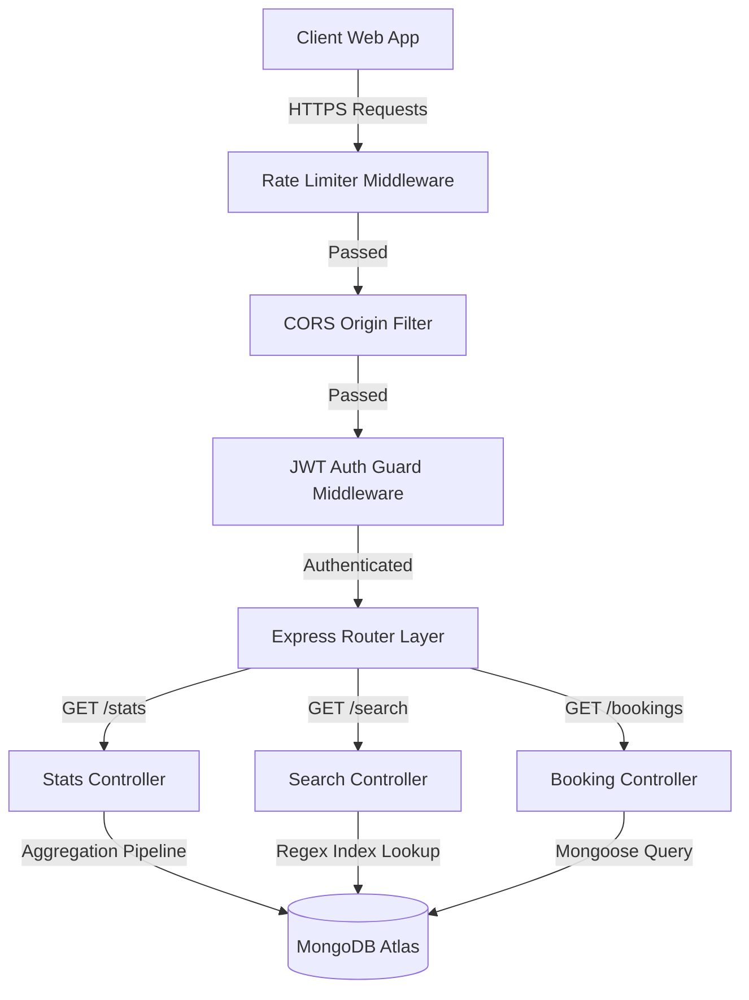

# 🚖 VehicleSphere - Production-Grade Booking & Analytics Engine (Backend)

### Manage Bookings. Optimize Analytics. Streamline Workforce Operations.

[](https://nodejs.org/)
[](https://expressjs.com/)
[](https://www.mongodb.com/)
[](https://mongoosejs.com/)
[](https://jwt.io/)

---

## 📖 Table of Contents
1. [Executive Summary](#-executive-summary)
2. [Key Architecture Blueprint](#-key-architecture-blueprint)
3. [Advanced Database & Performance Optimization](#-advanced-database--performance-optimization)
4. [Production Features & Middlewares](#-production-features--middlewares)
5. [Complete API Endpoints Directory](#-complete-api-endpoints-directory)
6. [Folder Structure](#-folder-structure)
7. [Installation & Local Setup](#-installation--local-setup)
8. [System Scaling Strategies](#-system-scaling-strategies)

---

## 🔍 Executive Summary

**VehicleSphere Backend** is an industry-grade **Vehicle Booking Backend API & Analytics Engine** built on Node.js, Express.js, and MongoDB. It manages booking logistics, calculates complex analytics, and handles administrator workforce operations.

The system scales to **18,289 clean, normalized booking records** using Mongoose-indexed data models, strict JWT-based role permissions (RBAC), and IP throttling. It resolves data gaps, prevents malicious inputs (DoS protection), and guarantees secure, authenticated request scoping.

---

## 🛠 Key Architecture Blueprint

VehicleSphere Backend is designed using the **MVC (Model-View-Controller)** pattern. Database models structure data, controllers parse requests, and routing layers secure endpoints:



---

## ⚡ Advanced Database & Performance Optimization

### 1. Robust Schema Design
The data schema in [booking.model.js](file:///d:/Vehicle_Bookings/backend/models/booking.model.js) stores all parameters cleanly with strict data sanitization (handling `"null"` values, parsing correct floats, and converting dates):

* **Booking Identifiers**: `bookingId` (unique, sparse index), `customerId`
* **Geographic Parameters**: `pickupLocation`, `dropLocation`, `distance`
* **Financial Details**: `fare`
* **Ratings Telemetry**: `driverRating`, `customerRating`
* **Time Metrics**: `bookingDate`, `vTat`, `cTat`
* **System Soft-delete**: `isDeleted` (defaults to `false`)

### 2. High-Performance Indexing Strategy
To ensure query operations take **O(log N)** time rather than full collection scans (O(N)), the following compound and single indices are defined:
* `userId: 1` — Fast lookup for user-associated bookings
* `bookingId: 1` — Unique query path for individual bookings
* `customerId: 1` — Speeds up customer booking history retrievals
* `bookingStatus: 1` — Filters rides by status enums
* `vehicleType: 1` — Speeds up vehicle category lookups
* `bookingDate: -1` — Drives reverse chronological listings
* `pickupLocation` / `dropLocation: 1` — Optimizes location search queries

---

## 🛡 Production Features & Middlewares

### 🔐 Security & Access Control
* **Password Hashing**: Uses `bcryptjs` for secure password storage with 10 salt rounds.
* **Role-Based Access Control (RBAC)**: Enforces scopes like `user` and `admin` using custom access checkers.
* **Dynamic Scoping**: Non-admin users are restricted to viewing, creating, or deleting only their own bookings (filtered by `userId: req.user._id`), while admin users retain full global operations.

### 🛡 Network Telemetry & Throttling
* **Rate Limiting**: Custom rate limiter middleware throttles requests to `100 requests per 15 minutes` per IP address.
* **CORS Dynamic Reflection**: Configured to reflect the developer origin during development and lock to the client URL in production, resolving CORS credentials issues.
* **Global Error Catching**: Catch-all middleware parses database failures, schema validation rejections, and invalid ObjectId exceptions into clean API responses.

---

## 📡 Complete API Endpoints Directory

### 🔐 Authentication Routes
| Method | Endpoint | Description | Auth Required |
| :--- | :--- | :--- | :--- |
| **POST** | `/auth/register` | Register new user | No |
| **POST** | `/auth/login` | Login user, returns JWT | No |
| **POST** | `/auth/logout` | Logout active session | Yes |
| **POST** | `/auth/forgot-password`| Forgot password request | No |
| **POST** | `/auth/reset-password` | Reset forgotten password | No |
| **POST** | `/auth/refresh-token` | Refresh JWT access token | No |
| **GET** | `/auth/me` | Fetch active user profile | Yes (HEAD supported) |
| **DELETE** | `/auth/account` | Delete user account | Yes |

### 🚖 Booking Management (REST CRUD)
| Method | Endpoint | Description | Auth Required |
| :--- | :--- | :--- | :--- |
| **POST** | `/bookings` | Create new booking | Yes |
| **GET** | `/bookings` | Fetch paginated & sorted bookings | Yes (HEAD & OPTIONS supported) |
| **GET** | `/bookings/:id` | Fetch booking by DB ID | Yes (HEAD & OPTIONS supported) |
| **PUT** | `/bookings/:id` | Replace booking details | Yes |
| **DELETE** | `/bookings/:id` | Delete booking permanently | Yes |
| **DELETE** | `/bookings/delete-all` | Clear all bookings | Yes |
| **POST** | `/bookings/bulk-insert`| Bulk insert bookings | Yes |
| **DELETE** | `/bookings/cancelled-rides/delete-all`| Clear cancelled bookings | Yes |

### 🔍 Custom Booking Parameters & Filters
| Method | Endpoint | Description | Auth Required |
| :--- | :--- | :--- | :--- |
| **GET** | `/bookings/id/:bookingId` | Fetch booking by custom booking ID | Yes |
| **GET** | `/bookings/status/:status` | Fetch bookings by status | Yes |
| **GET** | `/bookings/customer/:customerId`| Fetch bookings by customer ID | Yes |
| **GET** | `/bookings/vehicle/:vehicleType`| Fetch bookings by vehicle type | Yes |
| **GET** | `/bookings/payment/:method` | Fetch bookings by payment method | Yes |
| **GET** | `/bookings/pickup/:location` | Fetch bookings by pickup location | Yes |
| **GET** | `/bookings/drop/:location` | Fetch bookings by drop location | Yes |
| **GET** | `/bookings/date/:date` | Fetch bookings by date (YYYY-MM-DD) | Yes |
| **GET** | `/bookings/time/:time` | Fetch bookings by time (HH:MM) | Yes |
| **GET** | `/bookings/rating/driver/:rating`| Fetch bookings by driver rating | Yes |
| **GET** | `/bookings/rating/customer/:rating`| Fetch bookings by customer rating | Yes |
| **GET** | `/bookings/distance/:distance` | Fetch bookings by distance | Yes |
| **GET** | `/bookings/value/:amount` | Fetch bookings by fare value | Yes |
| **GET** | `/bookings/incomplete/:status`| Fetch incomplete status bookings | Yes |
| **GET** | `/bookings/incomplete-reason/:reason`| Fetch incomplete ride reasons | Yes |
| **GET** | `/bookings/cancel/customer/:reason`| Fetch customer cancellation reasons | Yes |
| **GET** | `/bookings/cancel/driver/:reason`| Fetch driver cancellation reasons | Yes |
| **GET** | `/bookings/vtat/:minutes` | Fetch bookings by VTAT (Vehicle TAT) | Yes |
| **GET** | `/bookings/ctat/:minutes` | Fetch bookings by CTAT (Customer TAT) | Yes |
| **GET** | `/bookings/day/:day` | Fetch bookings by day of month | Yes |
| **GET** | `/bookings/month/:month` | Fetch bookings by month (1-12) | Yes |
| **GET** | `/bookings/year/:year` | Fetch bookings by year | Yes |
| **GET** | `/bookings/hour/:hour` | Fetch bookings by hour (0-23) | Yes |
| **GET** | `/bookings/minute/:minute` | Fetch bookings by minute (0-59) | Yes |
| **GET** | `/bookings/source/:pickup` | Fetch bookings by pickup source | Yes |
| **GET** | `/bookings/destination/:drop`| Fetch bookings by drop destination | Yes |
| **GET** | `/bookings/vehicle-image/:name`| Fetch bookings by vehicle image name | Yes |
| **GET** | `/bookings/fare/:value` | Fetch bookings by fare value | Yes |
| **GET** | `/bookings/customer/:customerId/history`| Fetch booking history of customer | Yes |
| **GET** | `/bookings/customer/:customerId/latest`| Fetch latest booking of customer | Yes |

### 📈 Advanced Analytics & Status Routes
| Method | Endpoint | Description | Auth Required |
| :--- | :--- | :--- | :--- |
| **GET** | `/bookings/top/highest-fare`| Fetch top 10 highest fare bookings | Yes |
| **GET** | `/bookings/top/lowest-fare`| Fetch top 10 lowest fare bookings | Yes |
| **GET** | `/bookings/recent` | Fetch top 10 recent bookings | Yes |
| **GET** | `/bookings/latest` | Fetch latest 5 bookings | Yes |
| **GET** | `/bookings/random` | Fetch 5 random sample bookings | Yes |
| **GET** | `/bookings/trending` | Fetch trending rides | Yes |
| **GET** | `/bookings/success` | Fetch successful rides | Yes |
| **GET** | `/bookings/cancelled` | Fetch cancelled rides | Yes |
| **GET** | `/bookings/incomplete`| Fetch incomplete rides | Yes |
| **GET** | `/bookings/driver-not-found`| Fetch driver not found rides | Yes |
| **GET** | `/bookings/summary/ai` | Generate summary statistics | Yes |
| **GET** | `/bookings/compare` | Compare two booking IDs | Yes |

### 📊 Query Aggregation Routes
| Method | Endpoint | Description | Auth Required |
| :--- | :--- | :--- | :--- |
| **GET** | `/stats/total-bookings` | Fetch total bookings count | Yes (HEAD supported) |
| **GET** | `/stats/success-rides` | Fetch successful rides count | Yes |
| **GET** | `/stats/cancelled-rides`| Fetch cancelled rides count | Yes |
| **GET** | `/stats/incomplete-rides`| Fetch incomplete rides count | Yes |
| **GET** | `/stats/driver-not-found`| Fetch driver not found counts | Yes |
| **GET** | `/stats/total-customers`| Fetch total distinct customers | Yes |
| **GET** | `/stats/top-vehicle` | Fetch most booked vehicle type | Yes |
| **GET** | `/stats/top-payment-method`| Fetch top payment method | Yes |
| **GET** | `/stats/highest-fare` | Fetch highest booking fare | Yes |
| **GET** | `/stats/lowest-fare` | Fetch lowest booking fare | Yes |

### 🔍 Multi-field Search Routes
| Method | Endpoint | Description | Auth Required |
| :--- | :--- | :--- | :--- |
| **GET** | `/search` | Global keyword regex search | Yes (OPTIONS supported) |
| **GET** | `/search/bookings` | Search bookings by booking ID | Yes |
| **GET** | `/search/customers` | Search customer bookings by customer ID| Yes |
| **GET** | `/search/payment` | Search payments by method | Yes |
| **GET** | `/search/vehicle` | Search vehicles by category | Yes |
| **GET** | `/search/location` | Search pickup/drop locations | Yes |
| **GET** | `/search/cancel-reason` | Search cancellations by reason | Yes |
| **GET** | `/search/incomplete` | Search incomplete rides by reason | Yes |
| **GET** | `/search/rating` | Search rides by rating value | Yes |

### 👥 Secondary Entities & Pagination
| Method | Endpoint | Description | Auth Required |
| :--- | :--- | :--- | :--- |
| **GET** | `/customers` | Fetch paginated customer IDs list | Yes |
| **GET** | `/vehicles` | Fetch paginated vehicle types list | Yes |
| **GET** | `/success-rides` | Fetch paginated successful rides | Yes |
| **GET** | `/cancelled-rides` | Fetch paginated cancelled rides | Yes |
| **GET** | `/incomplete-rides` | Fetch paginated incomplete rides | Yes |
| **GET** | `/ratings` | Fetch paginated ratings list | Yes |
| **GET** | `/payments` | Fetch paginated payments list | Yes |
| **POST** | `/customers` | Create mock customer | Yes |
| **PUT** | `/customers/:customerId`| Update mock customer | Yes |
| **DELETE** | `/customers/:customerId`| Delete mock customer | Yes |
| **POST** | `/customers/bulk-insert`| Bulk insert customers | Yes |
| **DELETE** | `/customers/delete-all`| Clear all customers | Yes |
| **POST** | `/drivers` | Create mock driver | Yes |
| **PUT** | `/drivers/:driverId` | Update mock driver | Yes |
| **DELETE** | `/drivers/:driverId`| Delete mock driver | Yes |
| **POST** | `/drivers/bulk-insert`| Bulk insert drivers | Yes |
| **POST** | `/vehicles` | Create mock vehicle | Yes |
| **PUT** | `/vehicles/:vehicleId`| Update mock vehicle | Yes |
| **DELETE** | `/vehicles/:vehicleId`| Delete mock vehicle | Yes |
| **POST** | `/payments` | Create mock payment | Yes |
| **DELETE** | `/payments/:paymentId`| Delete mock payment | Yes |
| **POST** | `/ratings` | Create mock rating | Yes |
| **DELETE** | `/ratings/:ratingId` | Delete mock rating | Yes |
| **POST** | `/locations` | Create mock location | Yes |
| **GET** | `/locations` | Fetch distinct pickup/drop locations | Yes |
| **DELETE** | `/locations/:locationId`| Delete mock location | Yes |
| **DELETE** | `/logs/:id` | Clear application logs | Yes |

### 🔑 JWT Testing & Verification Routes
| Method | Endpoint | Description | Auth Required |
| :--- | :--- | :--- | :--- |
| **GET** | `/jwt/profile` | Fetch active user profile details | Yes (OPTIONS supported) |
| **GET** | `/jwt/dashboard` | Fetch JWT protected dashboard | Yes |
| **POST** | `/jwt/generate-token` | Generate fresh JWT token payload | No |
| **POST** | `/jwt/verify-token` | Verify signature of target JWT token | No |
| **POST** | `/jwt/refresh-token` | Re-issue fresh token from active one | No |
| **GET** | `/jwt/admin` | Test admin role verification | Yes (Admin Only) |
| **GET** | `/jwt/user` | Test standard user verification | Yes (User/Admin) |
| **DELETE** | `/jwt/logout` | Expire JWT session | Yes |

### 🩺 System Telemetry & Health Checks
| Method | Endpoint | Description | Auth Required |
| :--- | :--- | :--- | :--- |
| **GET** | `/health` | Fetch API health, state, and runtime | No (HEAD & OPTIONS supported) |
| **GET** | `/admin/dashboard` | Fetch overall platform counters | Yes (Admin Only - OPTIONS supported) |

---

## 📂 Folder Structure

```bash
backend/
│── config/
│   └── db.js                 # MongoDB connection logic
│── controllers/
│   ├── admin.controller.js   # Admin dashboard & users logic
│   ├── analytics.controller.js# Legacy aggregation routines
│   ├── auth.controller.js    # User authentication & tokens logic
│   ├── booking.controller.js # Core booking query & parameter handlers
│   ├── others.controller.js  # Secondary entity lists & pagination logic
│   ├── search.controller.js  # Dynamic multi-field search engine
│   └── stats.controller.js   # Advanced statistics aggregation
│── data/
│   ├── bookings.json         # Raw booking dataset (18,289 entries)
│   └── bookings_sample_preview.json
│── middlewares/
│   ├── auth.middleware.js    # JWT authorization validator
│   ├── error.middleware.js   # Global exception parser
│   ├── rateLimiter.middleware.js # API IP rate-limiting throttling
│   └── role.middleware.js    # RBAC security roles guard
│── models/
│   ├── booking.model.js      # Booking data model & schema indices
│   └── user.model.js         # User account authentication model
│── routes/
│   ├── admin.routes.js       # Admin actions routers
│   ├── analytics.routes.js   # Legacy analytics endpoints
│   ├── auth.routes.js        # Auth registration & profiles router
│   ├── booking.routes.js     # Booking CRUD & parameters router
│   ├── health.routes.js      # Telemetry health router
│   ├── jwt.routes.js         # Token testing router
│   ├── others.routes.js      # Pagination & mocks router
│   ├── search.routes.js      # Advanced search router
│   └── stats.routes.js       # Aggregated stats router
│── .env                      # Connection secrets configuration
│── app.js                    # Express app mounting center
│── package.json              # Project dependencies manifest
│── seed.js                   # Seeding execution script
└── server.js                 # App startup listener
```

---

## ⚙ Installation & Local Setup

### 1. Configure Environment Properties
Create a `.env` file inside the `backend/` directory:
```env
PORT=5000
NODE_ENV=development
MONGO_URI=your_mongodb_connection_string
JWT_SECRET=your_jwt_signing_secret_key
JWT_EXPIRES_IN=7d
```

### 2. Install Dependencies
```bash
npm install
```

### 3. Seed Database (18,289 Records)
```bash
node seed.js
```

### 4. Launch Development Server
```bash
npm run dev
```
The server will start on port `5000` with live-reloads active.

---

## 🚀 System Scaling Strategies

1. **Load Balancing & Reverse Proxies**: Mount **NGINX** or AWS ALB to distribute incoming request traffic across multiple Node.js server threads.
2. **Caching Strategy**: Introduce a **Redis** layer for caching analytics aggregation endpoints (like `/stats/total-bookings`) to reduce query load on MongoDB.
3. **Database Sharding**: Share the `bookings` collection across multiple MongoDB shards using `customerId` or `bookingDate` as the shard key to distribute storage.
4. **Message Queuing**: Implement **Apache Kafka** or RabbitMQ to stream booking events asynchronously, decoupling core CRUD operations from analytics tracking.
