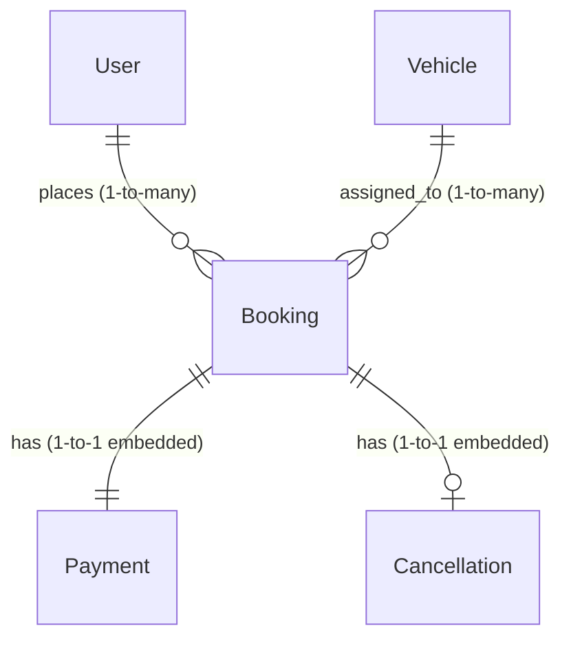

# Implementation Plan - Phase 0: Dataset Analysis & Database Planning

This document details the production-grade dataset analysis, schema architecture, database performance strategy, and API design mapping for the Vehicle Booking Backend System.

## Goal Description

Establish the architectural and database design foundation for a high-performance, scalable Vehicle Booking Backend using Node.js, Express, and MongoDB. We analyze a raw dataset of 18,289 records, identify system entities, define their relationships, address dirty data/inconsistencies, detail the collection schemas, map API requirements, and formulate indexing and performance strategies.

---

## User Review Required

> [!IMPORTANT]
> **Data Quality & Dirty Values:**
> - The raw dataset contains string values representing nulls (e.g., `"null"`, empty strings `""`). These must be normalized to standard database `null` or omitted.
> - Numbers (e.g., `"444"`) and ratings (e.g., `"4.8"`) are stored as strings in the raw file and must be parsed into proper MongoDB `Number` and `Double` formats.
> - Dates are formatted as `"YYYY-MM-DD HH:mm:ss"` and must be parsed into ISO-8601 UTC `Date` objects for indexing and query compatibility.

> [!TIP]
> **Normalization & Schema Separation:**
> - **Users & Bookings:** Currently, the dataset embeds the raw Customer_ID and Customer_Name inside the booking record. For a production system, we refer to a separate `users` collection via a `userId` reference to support authentication, role-based access control (RBAC), profile management, and relational integrity.
> - **Vehicles:** Vehicle details are restricted to type classifications (e.g., eBike, Bike, Auto, Prime Sedan, Prime SUV, Mini, Prime Plus). We suggest referencing a distinct `vehicles` collection or normalizing them as an enum within `bookings` for performance optimization depending on operational scale.

---

## Open Questions

> [!NOTE]
> **Driver Entity:**
> - The raw dataset implies the existence of drivers (e.g., via `Driver_Ratings` and `Canceled_Rides_by_Driver` fields) but does not include explicit Driver IDs or Driver profiles.
> - *Recommendation:* We should plan for an optional `drivers` collection referencing bookings to accommodate future driver profiles, or maintain ratings/cancellation reasons on the `Booking` schema for Phase 1. We will design the database to seamlessly support this referencing in the future.

---

## Proposed Changes

### Component: Database Architecture & Schema Design

Based on our analysis of the 18,289 records, we map the conceptual relationships and collections.

#### Entity Relationship Diagram (Conceptual)

#### MongoDB Collection Design

##### 1. `users` Collection
Stores authentication, profile, and authorization role details.
* **Fields:**
  * `_id`: ObjectId (Primary Key)
  * `name`: String (trimmed, required)
  * `email`: String (unique, indexed, validated regex, lowercase)
  * `password`: String (hashed using bcrypt, hidden by default in queries)
  * `role`: String (enum: `["user", "admin"]`, default `"user"`)
  * `isActive`: Boolean (default `true`)
  * `createdAt`: Date
  * `updatedAt`: Date

##### 2. `bookings` Collection
Core transactional document storing the details of each booking request.
* **Fields:**
  * `_id`: ObjectId (Primary Key)
  * `userId`: ObjectId (Reference to `users` collection)
  * `bookingId`: String (unique, matching raw `CNR...` format)
  * `vehicleType`: String (enum: `["sedan", "suv", "hatchback", "luxury", "mini", "plus", "bike", "ebike", "auto"]`)
  * `pickupLocation`: String (trimmed, indexed)
  * `dropLocation`: String (trimmed, indexed)
  * `distance`: Number (in km, default `0`)
  * `fare`: Number (calculated price, default `0`)
  * `bookingStatus`: String (enum: `["pending", "confirmed", "completed", "cancelled"]`)
  * `bookingDate`: Date (timestamp of booking)
  * `vTat`: Number (vehicle turn-around time in seconds, or `null`)
  * `cTat`: Number (customer turn-around time in seconds, or `null`)
  * `rideStartTime`: Date (or `null`)
  * `rideEndTime`: Date (or `null`)
  * `driverRating`: Number (float 1-5, or `null`)
  * `customerRating`: Number (float 1-5, or `null`)
  * `payment`: Embedded Object (`PaymentSchema`)
  * `cancellation`: Embedded Object (`CancellationSchema`, optional)
  * `incompleteRide`: Embedded Object (`IncompleteRideSchema`, optional)
  * `isDeleted`: Boolean (default `false` for soft-deletions)

##### 3. Embedded Payment Schema (within Booking)
* **Fields:**
  * `method`: String (enum: `["cash", "card", "upi", "net_banking"]`, default `"cash"`)
  * `status`: String (enum: `["pending", "paid", "failed", "refunded"]`, default `"pending"`)
  * `transactionId`: String (optional)

##### 4. Embedded Cancellation Schema (within Booking)
* **Fields:**
  * `cancelledBy`: String (enum: `["customer", "driver", "system"]`)
  * `reason`: String (trimmed)

---

## Embedding vs Referencing Strategy

| Association | Decision | Justification |
| :--- | :--- | :--- |
| **User → Bookings** | **Referencing** (1-to-many) | A customer can have hundreds of bookings. Embedding them inside the user document would quickly hit MongoDB's 16MB document size limit and degrade write/read performance. |
| **Vehicle → Bookings** | **Referencing** (many-to-1) | Vehicle metadata (make, license plate, driver details) change independently of the booking history. Storing a reference ensures clean data normalization. |
| **Booking → Payment** | **Embedding** (1-to-1) | Payment details belong strictly to a single transaction and are always queried together with the booking details. |
| **Booking → Locations** | **Embedding** (1-to-1) | Pickup and Drop address coordinates/strings are atomic to a specific booking and never change. |

---

## Field Normalization Rules

We process raw dirty data using standard conversion logic in the cleaning utility:

| Raw Property | Raw Value | Converted/Normalized Value | Database Target Type |
| :--- | :--- | :--- | :--- |
| `Date` / `Time` | `"2024-07-26 14:00:00"` | `2024-07-26T14:00:00.000Z` | `Date` |
| `V_TAT` / `C_TAT` | `"null"` or `"undefined"` | `null` | `Number` or `null` |
| `Booking_Value` | `"444"` | `444` | `Number` |
| `Driver_Ratings` | `"4.1"` or `"null"` | `4.1` or `null` | `Number` (Float) or `null` |
| `Customer_Rating` | `"null"` | `null` | `Number` (Float) or `null` |
| `Booking_Status` | `"Success"` | `"completed"` | `String` (Enum normalized) |
| `Booking_Status` | `"Canceled by Driver"` | `"cancelled"` | `String` (Enum normalized) |
| `Payment_Method` | `"null"` | `"cash"` (or schema-based default) | `String` (Enum) |

---

## Indexing Strategy

For high-speed reads, search filtering, and robust analytics pipelines:

### Single Field Indexes
- `users.email` (Unique: true) - Fast authentication lookup.
- `bookings.bookingDate` (-1) - Chronological feeds and date-range queries.
- `bookings.bookingStatus` (1) - Status filtering dashboard counters.
- `bookings.userId` (1) - Fetching booking history for a specific customer.

### Compound Indexes
- `{ bookingStatus: 1, bookingDate: -1 }` - Optimizes active status filtering by date ranges.
- `{ vehicleType: 1, bookingDate: -1 }` - Fast historical queries per vehicle class.

---

## API Requirement Mapping

The database schema directly powers all core routes:

### 1. Booking APIs
- **Create Booking:** Validates fields against schema constraints, computes dynamic fare, and saves booking status.
- **Filter Bookings:** Fast indexed search using dynamic query filters (status, vehicle type, rating, fare/distance range).

### 2. Analytics APIs
- **Booking Stats & Success Rate:** Fast aggregation using indexed matching on `bookingStatus` and `bookingDate`.
- **Top Vehicles & Monthly Trends:** Handled using multi-stage aggregation pipelines (`$group` + `$sort`) optimized with index support.

### 3. Admin APIs
- **User Control & Deactivation:** Toggles `users.isActive` instantly with simple CRUD.
- **Dashboard Counters:** Fast `countDocuments` queries utilizing single-field indexes.

---

## Verification Plan

### Automated Verification
- Run database seeding scripts to parse the full 18,289 dataset records into MongoDB.
- Verify zero syntax or Mongoose validation failures during parsing and insertion.
- Run database query optimization tests (`db.bookings.find().explain("executionStats")`) to confirm index usage and verify that `IXSCAN` is chosen instead of `COLLSCAN`.

### Manual Verification
- Deploy schema to local MongoDB instance and review collection field mapping using MongoDB Compass.
- Test edge case dataset records containing `"null"` and `"#NAME?"` values to confirm successful normalization.
